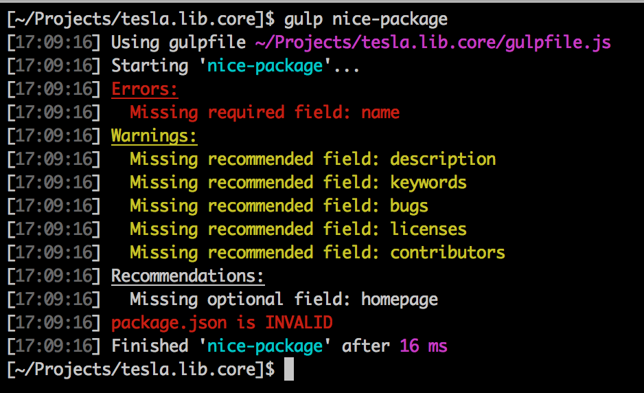

# [gulp](http://gulpjs.com/)-nice-package [![NPM version][npm-image]][npm-url] [![Build Status][travis-image]][travis-url]

> Opinionated package.json validator. Uses [package.json-validator](https://github.com/gorillamania/package.json-validator) under the covers



## Install

```shell
npm install gulp-nice-package --save-dev
```

## Usage

```js
// gulpfile.js
var gulp = require('gulp');
var validate = require('gulp-nice-package');

gulp.task('validate-json', function () {
  return gulp.src('package.json')
    .pipe(validate());
});
```

## Options

Any options defined are simply passed along to 
[package.json-validator](https://github.com/gorillamania/package.json-validator#api)

```js
// gulpfile.js
var gulp = require('gulp');
var validate = require('gulp-nice-package');

gulp.task('validate-json', function () {
  return gulp.src('package.json')
    .pipe(validate('npm', {
      warnings: false,
      recommendations: false
    }));
});
```

## Failing your build

The below will both print errors to the console and exit the gulp process with an appropriate error code for
properly failing builds.

```js
var gulp = require('gulp'),
  validate = require('gulp-nice-package'),
  mapstream = require('map-stream');

process.on('exit', function () {
  process.nextTick(function () {
    process.exit(1);
  });
});

gulp.task('validate-json', function () {
  var isValid = true;
  return gulp.src('package.json')
    .pipe(validate())
    .pipe(mapstream(function (file, cb) {
      isValid = file.nicePackage.valid;
      cb(null, file);
    }))
    .on('end', function() {
      if (!isValid) {
        process.emit('exit');
      }
    });
});
```

I know, it seems a bit terse. The reasoning is, you may want to pipe other transforms onto the stream and, if an
error is thrown, the pipe will cease and you have no way to continue. A valid use case may be to actually fix the
the package.json file programmatically if it's invalid, e.g. with [gulp-shrinkwrap](https://github.com/chmontgomery/gulp-shrinkwrap).

If you have no need to further process the stream after validation, you can pipe the stream to `validate.failOnError()`
to fail the build in the event one or more errors are raised during validation.

```js
// gulpfile.js
var gulp = require('gulp');
var validate = require('gulp-nice-package');

gulp.task('validate-json', function () {
  return gulp.src('package.json')
    .pipe(validate())
    .pipe(validate.failOnError());
});
```

## License

[MIT](http://opensource.org/licenses/MIT) © [Chris Montgomery](http://www.chrismontgomery.info/)

[npm-url]: https://npmjs.org/package/gulp-nice-package
[npm-image]: http://img.shields.io/npm/v/gulp-nice-package.svg
[travis-image]: https://travis-ci.org/chmontgomery/gulp-nice-package.svg?branch=master
[travis-url]: https://travis-ci.org/chmontgomery/gulp-nice-package